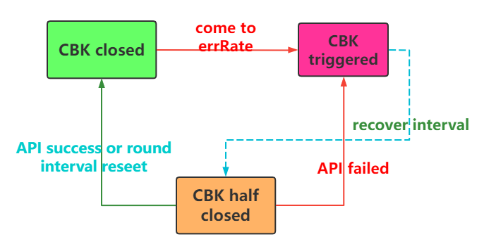
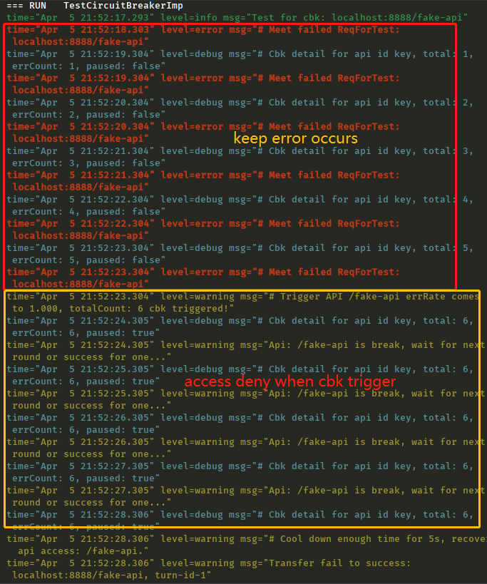

# cbk-s1mpl3
A simple implement of circuit breaker with Go, trigger for fail-fast and return quickly when your API comes to high error rate durning a period of time.
You can assume making API as a unique entity for your project, it could be a uri path or database handling. :)

## Chinese Version 
[中文文档](README-CH.md)

## Core feature
- **dynamic adjustment**  
Every access for api will count for a period of time, and mark the status of succeed or failed, that depended on your business.There are few params configurable:
  - **minCheck**：at least request for how much time durning the round interval will take it necessary
  - **cbkErrRate**： the error rate to trigger circuit breaker
  - **roundInterval**：reset all api count, included total/succeed/failed, that means you server can accept the err rate durning this.
- **recover interval**：when breaker is triggered, how long to cool down until allow for next try to check if your api is ok.  

About state transition, you can look at this visual img.


## Detail code
### interface define
```go
type CircuitBreaker interface {
    // check if your api(key) allow to access
    CanAccess(key string) bool
    // mark failed api result
    Failed(key string)
    // mark succeed api result
    Succeed(key string)
}
```
### implement
```go
type CircuitBreakerImp struct {
    lock            sync.RWMutex
    apiMap          map[string]*apiSnapShop 
    minCheck        int64                   
    cbkErrRate      float64                 
    recoverInterval time.Duration           
    roundInterval   time.Duration           
}
```
API's detail info
```go
type apiSnapShop struct {
    isPaused   bool  
    errCount   int64 
    totalCount int64 
    accessLast int64  // last access time
    roundLast  int64  // start time for this round 
}
```
----

## Quick Start(unittest demo) 

### initialize for cbk
```go
cbk := &CircuitBreakerImp{}
cbk.apiMap = make(map[string]*apiSnapShop)
// 15s per round to reset the err rate
cbk.roundInterval = util.ToDuration(15 * time.Second)
// when breaker is triggered, recover for next try
cbk.recoverInterval = util.ToDuration(5 * time.Second)
// consider the api at least request for 5 time durning the round interval
cbk.minCheck = 5
// when error rate comes to 50%, circuit breaker triggered
cbk.cbkErrRate = 0.5
```

```go
func TestCircuitBreakerImp(t *testing.T) {
	log.Infof("Test for cbk: %s", HOST_PREFIX+MOCK_API)

	cbk := &CircuitBreakerImp{}
	cbk.apiMap = make(map[string]*apiSnapShop)
	// reset api metric when round end per 15s
	cbk.roundInterval = util.ToDuration(15 * time.Second)
	// allow to access when cbk triggered in a round per 5s
	cbk.recoverInterval = util.ToDuration(5 * time.Second)
	cbk.minCheck = 5
	cbk.cbkErrRate = 0.5
	StartMock(cbk)
}

func StartMock(cbk *CircuitBreakerImp) {
	for {
		// mock failed for every second
		ticker := time.NewTicker(time.Second)
		select {
		case <-ticker.C:
			ReqForTest(cbk, 0)
		}
	}
}

func ReqForTest(cbk *CircuitBreakerImp, turn int) {
	//log.Infof("Ready to reqForTest: %s, turn-id-%v", HOST_PREFIX+MOCK_API, turn)

	if !cbk.CanAccess(MOCK_API) {
		log.Warnf("Api: %v is break, wait for next round or success for one...", MOCK_API)
		NeetCoolDown = true
		return
	} else {
		//log.Infof("Request access allow: %s", HOST_PREFIX+MOCK_API)
		// after
		if NeetCoolDown && turn == 0 {
			NeetCoolDown = false
			turn = 1
			log.Warnf("Transfer fail to success: %s, turn-id-%v", HOST_PREFIX+MOCK_API, turn)
		}
	}

	if turn == 0 {
		log.Errorf("# Meet failed ReqForTest: %s", HOST_PREFIX+MOCK_API)
		cbk.Failed(MOCK_API)
	} else {
		log.Infof("# Meet success ReqForTest: %s", HOST_PREFIX+MOCK_API)
		cbk.Succeed(MOCK_API)
	}
}
```

### OutPut


As you can see, at first the mock api is not be paid attention, till it comes to our cbk condition and start to denied. When cool down(after 5s), the cbk allow it to access again.

Any question keep in touch :)

## Reference
**Circuit Breaker Pattern**  
https://docs.microsoft.com/en-us/previous-versions/msp-n-p/dn589784(v=pandp.10)  
**Sony gobreaker**  
https://github.com/sony/gobreaker  
